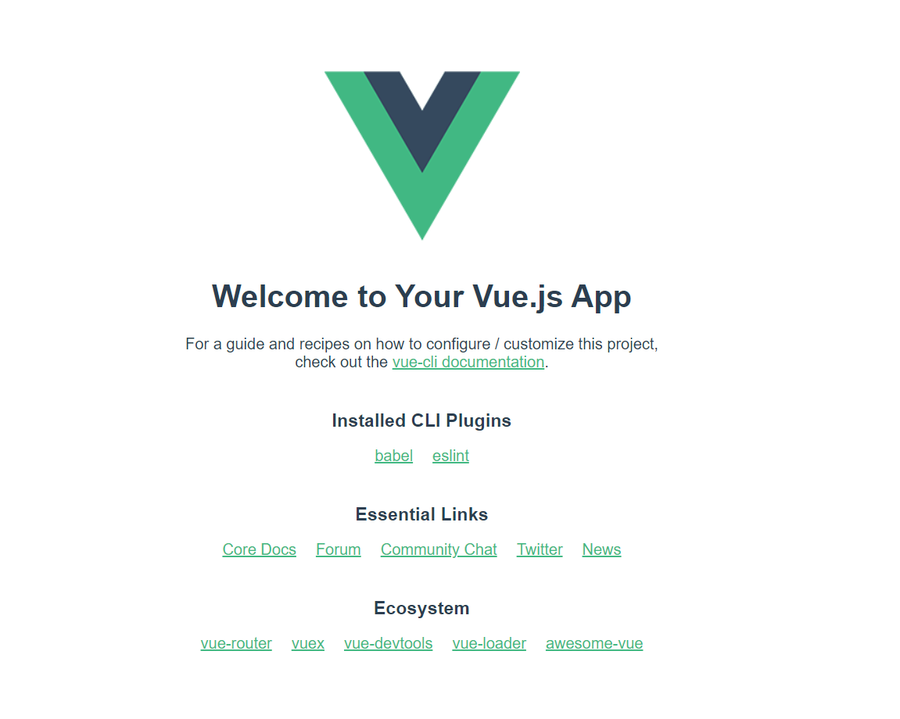

# プロジェクトの作成

## Vue CLI でのプロジェクト新規作成

Vue CLI を使って生成されるアプリケーションをプロジェクトと呼びます。ここではプロジェクトを新しく作成する方法を紹介します。

1. アプリケーションを作成するディレクトリを決めておきます（この例では `vue3-lab` としています）。Vue CLI でプロジェクトを作成すると、決めたディレクトリの配下にファイル群が生成されます。

2. ターミナルで、プロジェクトのディレクトリを作成する親ディレクトリに移動します。もし、ホームディレクトリの直下にプロジェクトを作成するのであれば、ターミナルで以下のコマンドを使って移動しておきます。

   ```sh
   cd ~
   ```

   ::: tip ヒント
   ホームディレクトリとは、ユーザー固有のファイルやフォルダを保存できる領域であり、通常ユーザー名でディレクトリが作成されています。
   :::

3. Vue CLI でプロジェクトを新規作成します。ターミナルで以下のコマンドを実行します（コマンド実行後はそのまま待機しておいてください）。プロジェクトのディレクトリは Vue CLI によって自動的に作成されます。

   ```sh
   vue create vue3-lab
   ```

   ::: tip ヒント 
   なお、このハンズオンでは `Vue CLI v4.5.13` を使用して説明しています。
   :::

4. コマンドを実行すると、ターミナルに `Please pick a preset` と表示されます。このハンズオンでは以下のように `Default (Vue 3) ([Vue 3] babel, eslint) ` を選択します。

   ```sh
   Vue CLI v4.5.13
   ? Please pick a preset:
     Default ([Vue 2] babel, eslint)
   ❯ Default (Vue 3) ([Vue 3] babel, eslint)
     Manually select features
   ```

   ::: tip ヒント
   矢印キーで移動、return キーで確定ができます。
   :::

   ::: warning 注意
   お使いの環境によっては、パッケージマネージャーを選択する画面になることがあります。このハンズオンでは、npm を前提に説明を進めます。
   :::

## プロジェクトの起動

1. `vue create` の処理が完了したら、作成したプロジェクトのディレクトリに移動し（この例では `vue3-lab`）、プロジェクトを起動します。

   ```sh
   cd vue3-lab
   npm run serve
   ```

1. `npm run serve` の実行が完了したら、ブラウザで `http://localhost:8080/` にアクセスします。

1. ブラウザに「Welcome to Your Vue.js App」等と表示されていれば、無事にプロジェクトの作成が成功しています。

   

   `vue create` コマンドの詳細は [Creating a Project \| Vue CLI](https://cli.vuejs.org/guide/creating-a-project.html) を確認してください。
