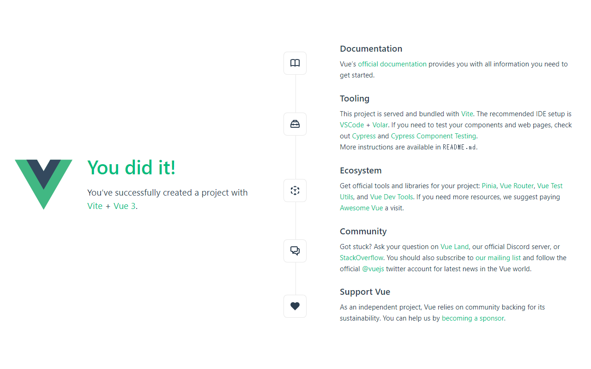

# プロジェクトの作成

## create-vue でのプロジェクト新規作成

[create-vue](https://github.com/vuejs/create-vue) を使って生成されるアプリケーションをプロジェクトと呼びます。ここではプロジェクトを新しく作成してみましょう。

1. アプリケーションを作成するディレクトリを決めておきます（この例では `vue3-lab` としています）。`create-vue` でプロジェクトを作成すると、決めたディレクトリの配下にファイル群が生成されます。

1. ターミナルで、プロジェクトのディレクトリを作成する親ディレクトリに移動します。もし、ホームディレクトリの直下にプロジェクトを作成するのであれば、ターミナルで以下のコマンドを使って移動しておきます。

  ```sh
  cd ~
  ```

  ::: tip ヒント
  ホームディレクトリとは、ユーザー固有のファイルやフォルダを保存できる領域であり、通常ユーザー名でディレクトリが作成されています。
  :::

1. `create-vue` でプロジェクトを新規作成します。ターミナルで以下のコマンドを実行します（コマンド実行後はそのまま待機しておいてください）。プロジェクトのディレクトリは `create-vue` によって自動的に作成されます。

  ```sh
  npm init vue@3 vue3-lab
  ```

1. コマンドを実行すると、ターミナルにいくつかの質問が表示されます。このハンズオンでは以下のように選択します。

  ```
  Need to install the following packages:
    create-vue@3
  Ok to proceed? (y) -> y 
  ```

  ::: tip ヒント
  y を入力し、enter / return キーで確定ができます。
  :::

  ```
  Vue.js - The Progressive JavaScript Framework
    Add TypeScript? … No / Yes -> No
    Add JSX Support? … No / Yes -> No
    Add Vue Router for Single Page Application development? … No / Yes -> No
    Add Pinia for state management? … No / Yes -> No
    Add Vitest for Unit Testing? … No / Yes -> No
    Add Cypress for both Unit and End-to-End testing? … No / Yes -> No
    Add ESLint for code quality? … No / Yes -> No
  ```

  ::: tip ヒント
  矢印キーで移動、enter / return キーで確定ができます。
  :::

## プロジェクトの起動

作成したプロジェクトを起動してみましょう。プロジェクトの起動には外部パッケージをインストールしてから起動コマンドを実行します。

1. 作成したプロジェクトのディレクトリに移動し（この例では `vue3-lab`）、`npm install` で外部パッケージをインストールします。

  ```sh
  cd vue3-lab
  npm install
  ```

1. `npm install` の処理が完了したら `npm run dev` でプロジェクトを起動します。

  ```sh
  npm run dev
  ```

1. `npm run dev` の実行が完了したら、ブラウザで `http://localhost:5173/` にアクセスします。

1. ブラウザに「You did it!」等と表示されていれば、無事にプロジェクトの作成が成功しています。

## プロジェクトの確認

プロジェクト新規作成後、以下のようなディレクトリ構造になります。

  ```
  vue3-lab
  ├── README.md
  ├── index.html
  ├── node_modules
  ├── package-lock.json
  ├── package.json
  ├── public
  │   └── favicon.ico
  ├── src
  │   ├── App.vue
  │   ├── assets
  │   │   ├── base.css
  │   │   ├── logo.svg
  │   │   └── main.css
  │   ├── components
  │   │   ├── HelloWorld.vue
  │   │   ├── TheWelcome.vue
  │   │   ├── WelcomeItem.vue
  │   │   └── icons
  │   │       ├── IconCommunity.vue
  │   │       ├── IconDocumentation.vue
  │   │       ├── IconEcosystem.vue
  │   │       ├── IconSupport.vue
  │   │       └── IconTooling.vue
  │   └── main.js
  └── vite.config.js

  6 directories, 19 files
  ```

これらのファイルが create-vue で作成されます。

  
