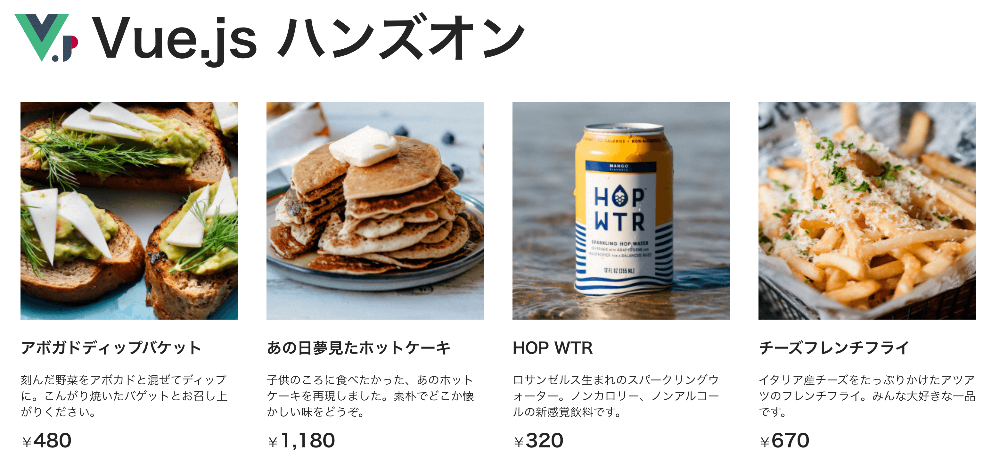

# ハンズオンの概要

## 作成するもの

このハンズオンでは、簡単な商品の一覧を表示し、購入する商品を選択できるプログラムを作成します。プログラムを作成する過程で、 Vue.js の基本を学ぶことができます。実際に動く物は <a href="hogehoge">こちら</a> から見れます。



## 作成の流れ

- [開発環境の構築](./setup.md "開発環境の構築")  
- [プロジェクトの作成](./create.md "プロジェクトの作成")  
- [ハンズオンの概要（本ページ）](./overview.md "ハンズオンの概要（本ページ）")  
- [data を定義し、商品をレンダリングする](./rendering.md "data を定義し、商品をレンダリングする")  
- [v-for で繰り返しを表現する（商品複数）](./v-for.md "v-for で繰り返しを表現する（商品複数）")  
- [v-if を使用した表示・非表示の切り替え](./v-if.md "v-if を使用した表示・非表示の切り替え")  
- [methods で価格にカンマを入れる](./methods.md "methods で価格にカンマを入れる")  
- [@click でイベントを処理する（クラスの切り替え）](./event.md "@click でイベントを処理する（クラスの切り替え）")  

## Vue.js を使わない場合

Vue.js でのハンズオンに入る前に Vue.js を使わないで実装した場合のプログラムを見てみましょう。

index.html

```html
<!DOCTYPE html>
<html lang="ja">
  <head>
    <meta charset="utf-8" />
    <meta http-equiv="X-UA-Compatible" content="IE=edge" />
    <meta name="viewport" content="width=device-width,initial-scale=1.0" />
    <link rel="icon" href="<%= BASE_URL %>favicon.ico" />
    <title>Vue.js ハンズオン</title>
    <link rel="stylesheet" href="./style.css" />
  </head>
  <body>
    <noscript>
      <strong
        >We're sorry but vue3-lab doesn't work properly without JavaScript
        enabled. Please enable it to continue.</strong
      >
    </noscript>
    <div>
      <header class="header">
        
        <h1>Vue.js ハンズオン</h1>
      </header>
      <main class="main">
        <div class="item">
          <div class="thumbnail">
            
          </div>
          <div class="description">
            <h2>アボカドディップバケット</h2>
            <p>
              刻んだ野菜をアボカドと混ぜてディップに。こんがり焼いたバゲットとお召し上がりください。
            </p>
            <span>¥<span class="price">480</span></span>
          </div>
        </div>
        <div class="item">
          <div class="thumbnail">
            
          </div>
          <div class="description">
            <h2>あの日夢見たホットケーキ</h2>
            <p>
              子供のころに食べたかった、あのホットケーキを再現しました。素朴でどこか懐かしい味をどうぞ。
            </p>
            <span>¥<span class="price">1,180</span></span>
          </div>
        </div>
        <div class="item">
          <div class="thumbnail">
            
          </div>
          <div class="description">
            <h2>HOP WTR</h2>
            <p>
              ロサンゼルス生まれのスパークリングウォーター。ノンカロリー、ノンアルコールの新感覚飲料です。
            </p>
            <span>¥<span class="price">320</span></span>
          </div>
        </div>
        <div class="item">
          <div class="thumbnail">
            
          </div>
          <div class="description">
            <h2>チーズフレンチフライ</h2>
            <p>
              イタリア産チーズをたっぷりかけたアツアツのフレンチフライ。みんな大好きな一品です。
            </p>
            <span>¥<span class="price">670</span></span>
          </div>
        </div>
      </main>
    </div>
  </body>
</html>
```

style.css

```css
body {
  font-family: sans-serif;
  margin: 0;
  -webkit-font-smoothing: antialiased;
  -moz-osx-font-smoothing: grayscale;
}

#app {
  width: 90%;
  margin: 0 5%;
  text-align: center;
  color: #242424;
}

.header {
  display: flex;
  align-content: center;
  align-items: center;
  margin-top: 40px;
  margin-bottom: 40px;
}

.header > img {
  width: 100px;
  height: 100px;
  margin-right: 20px;
}

.header > h1 {
  font-size: 80px;
  font-weight: bold;
  line-height: 80px;
  margin-top: 0;
  margin-bottom: 0;
}

.main {
  display: grid;
  grid-template-columns: 3fr 3fr 3fr 3fr;
  column-gap: 24px;
  row-gap: 24px;
}

.item {
  padding: 10px;
  cursor: pointer;
}

.item:hover {
  transition: 0.2s transform ease-out;
  transform: scale(1.05);
}

.item > div.thumbnail > img {
  width: 100%;
  height: calc(width);
  object-fit: cover;
}

.item > div.description {
  text-align: left;
  margin-top: 20px;
}

.item > div.description > h3,
.item > div.description > p {
  margin-top: 0px;
  margin-bottom: 0px;
  font-size: 18px;
  line-height: 25px;
}

.item > div.description > h3 {
  font-weight: bold;
}

.item > div.description > span {
  display: block;
  margin-top: 10px;
  font-size: 20px;
}

.item > div.description > span > .price {
  font-size: 28px;
  font-weight: bold;
}

.selected-item {
  background: #e3f2fd;
}
```

## 商品表示部分の説明

簡単ですが、商品表示部分を説明します。

- `<div class="thumbnail">~</div>` の部分では商品のサムネイル画像を表示しています。
- `<div class="description">~</div>` の部分では商品の名前と商品の説明を表示しています。
- `<div class="price">~</div>` の部分では商品の値段を表示しています。

```html
<div class="item">
  <div class="thumbnail">
    
  </div>
  <div class="description">
    <h2>アボカドディップバケット</h2>
    <p>
      刻んだ野菜をアボカドと混ぜてディップに。こんがり焼いたバゲットとお召し上がりください。
    </p>
    <span>¥<span class="price">480</span></span>
  </div>
</div>
```

## Vue.js を使わない場合の問題点

Vue.js を使わない場合、例えば次のような問題が発生します。

- 商品の情報と HTML のタグが混ざっていて見通しが悪い。
- 複数の商品を記述するとき、同じ構造のタグを繰り返す必要がある。
- 商品を増減するとき、タグを追加・削除する手間がかかる。
- 商品の状態（売り切れや金額表記など）によって情報やタグを書き分ける必要がある。
- インタラクションを実装するとき、HTML と JavaScript が依存関係になる。

## Vue.js を使った場合のプログラム

記述の意味はハンズオンで順を追って説明していきますが、 Vue.js に変更後のコードをみてみましょう。

Example.Vue

```html
<template>
  <header class="header">
    
    <h1>Vue.js ハンズオン</h1>
  </header>
  <main class="main">
    <div v-for="item in items" :key="item.id">
      <div
        v-if="!item.soldOut"
        class="item"
        :class="{ 'selected-item': item.selected }"
        @click="item.selected = !item.selected">
        <div class="thumbnail">
          
        </div>
        <div class="description">
          <h2>{{ item.name }}</h2>
          <p>{{ item.description }}</p>
          <span>¥<span class="price">{{ pricePrefix(item.price) }}</span></span>
        </div>
      </div>
    </div>
  </main>
</template>

<script>
export default {
  name: 'App',
  data() {
    return {
      items: [
        {
          id: 1,
          name: 'アボカドディップバケット',
          description:
            '刻んだ野菜をアボカドと混ぜてディップに。こんがり焼いたバゲットとお召し上がりください。',
          price: 480,
          image: '/images/item1.jpg',
          soldOut: false,
          selected: false
        },
        {
          id: 2,
          name: 'あの日夢見たホットケーキ',
          description:
            '子供のころに食べたかった、あのホットケーキを再現しました。素朴でどこか懐かしい味をどうぞ。',
          price: 1180,
          image: '/images/item2.jpg',
          soldOut: false,
          selected: false
        },
        {
          id: 3,
          name: 'HOP WTR',
          description:
            'ロサンゼルス生まれのスパークリングウォーター。ノンカロリー、ノンアルコールの新感覚飲料です。',
          price: 320,
          image: '/images/item3.jpg',
          soldOut: false,
          selected: false
        },
        {
          id: 4,
          name: 'チーズフレンチフライ',
          description:
            'イタリア産チーズをたっぷりかけたアツアツのフレンチフライ。みんな大好きな一品です。',
          price: 670,
          image: '/images/item4.jpg',
          soldOut: false,
          selected: false
        },
        {
          id: 5,
          name: '商品５',
          description: '商品５の説明です',
          price: 500,
          image: '/images/item4.jpg',
          soldOut: true,
          selected: false
        }
      ]
    }
  },
  methods: {
    /**
     * 価格を3桁ごとのカンマ付きで返す
     * @param {number} price 価格
     */
    pricePrefix(price) {
      return price.toLocaleString()
    }
  }
}
</script>

<style>
body {
  font-family: sans-serif;
  margin: 0;
  -webkit-font-smoothing: antialiased;
  -moz-osx-font-smoothing: grayscale;
}

#app {
  width: 90%;
  margin: 0 5%;
  text-align: center;
  color: #242424;
}

.header {
  display: flex;
  align-content: center;
  align-items: center;
  margin-top: 40px;
  margin-bottom: 40px;
}

.header > img {
  width: 100px;
  height: 100px;
  margin-right: 20px;
}

.header > h1 {
  font-size: 80px;
  font-weight: bold;
  line-height: 80px;
  margin-top: 0;
  margin-bottom: 0;
}

.main {
  display: grid;
  grid-template-columns: 3fr 3fr 3fr 3fr;
  column-gap: 24px;
  row-gap: 24px;
}

.item {
  padding: 10px;
  cursor: pointer;
}

.item:hover {
  transition: 0.2s transform ease-out;
  transform: scale(1.05);
}

.item > div.thumbnail > img {
  width: 100%;
  height: calc(width);
  object-fit: cover;
}

.item > div.description {
  text-align: left;
  margin-top: 20px;
}

.item > div.description > p {
  margin-top: 0px;
  margin-bottom: 0px;
  font-size: 18px;
  line-height: 25px;
}

.item > div.description > span {
  display: block;
  margin-top: 10px;
  font-size: 20px;
}

.item > div.description > span > .price {
  font-size: 28px;
  font-weight: bold;
}

.selected-item {
  background: #e3f2fd;
}
</style>
```

`<template>~</template>` 部分は見た目の表示が記述されています。冗長な記述が減っていて Vue.js を使わない場合に比べてとても短いですね。

`<script>~</script>` 部分は商品の情報や動作等が記述されています。特に `items` では商品の情報や状態だけのデータで HTML のタグがなくなっています。「見た目、処理、商品のデータ」が綺麗に分かれており、見通しがよくなっているのが、既に感じられるかと思います。

他にも Vue.js の強力な力はありますが、実際にハンズオンを進めていく中で体験していきましょう！
