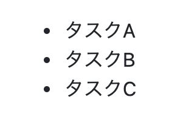
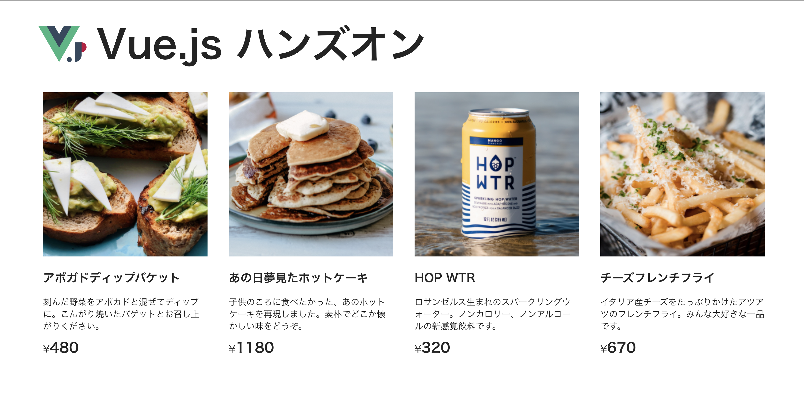

# v-for で商品を複数表示する

新しい商品が入荷したので、複数の商品を販売することになりました。商品を複数表示してみましょう。

## v-for の書き方

Vue.js では、配列からデータを取り出し、繰り返しで表示する、`v-for` というディレクティブが用意されています。

`v-for` ディレクティブは、 `task in tasks` のような構文で書きます。 `tasks` はデータを取り出す元の配列で、あらかじめ用意した配列の名前を指定します。 `task` は配列から取り出した 1 つ 1 つの値にアクセスするエイリアスで、任意の名前を指定します。

::: v-pre
以下の例では `data` 部分の `tasks` からデータを取り出し `{{ task }}` で表示しています。
:::

```html
<div id="app">
  <ul>
    <li v-for="task in tasks">{{ task }}</li>
  </ul>
</div>
```

```js
var app = new Vue({
  el: '#app',
  data() {
    return {
      tasks: [
        'タスクA',
        'タスクB',
        'タスクC',
      ]
    }
  }
})
```

出力例
```
・タスクA
・タスクB
・タスクC
```



## 複数の商品をレンダリング
プロジェクトのファイルを書き換えて、複数の商品をレンダリングしていきましょう。`src/App.vue` ファイルを次のように変更します。

まずは、 data に表示したい商品を設定します。 `item` から `items` に変更し商品のオブジェクトを持つ配列にします。

変更前

<<< @/../examples/rendering/src/App.vue#script{6-12}

変更後

<<< @/../examples/v-for/src/App.vue#script{6-39}

次に、 `v-for` を用いて、各商品の「名前（name）」、「説明（description）」、「価格（price）」、「画像（image）」を繰り返し表示します。

同時に指定している `key` 属性は、 `v-for` で取り出した各要素を一意（ユニーク）にするために推奨されているものです。一意にすることで、 Vue.js が要素の再利用や並び替えをする手助けになります。 詳細は [Vue.jsドキュメントガイド 状態の維持](https://v3.ja.vuejs.org/guide/list.html#%E7%8A%B6%E6%85%8B%E3%81%AE%E7%B6%AD%E6%8C%81 "Vue.jsドキュメントガイド 状態の維持")を参照してください。  

変更前

<<< @/../examples/rendering/src/App.vue#template{7-16}

変更後

<<< @/../examples/v-for/src/App.vue#template{7-18}



これで、商品を複数レンダリングできました。

::: tip ヒント
v-for を使った template タグは DOM 要素としてレンダリングされません。
:::

